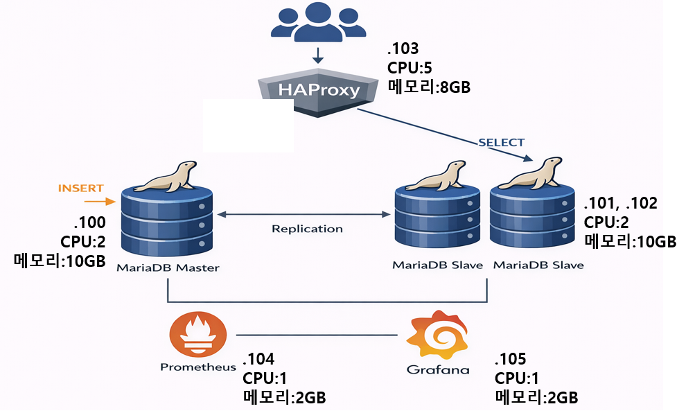
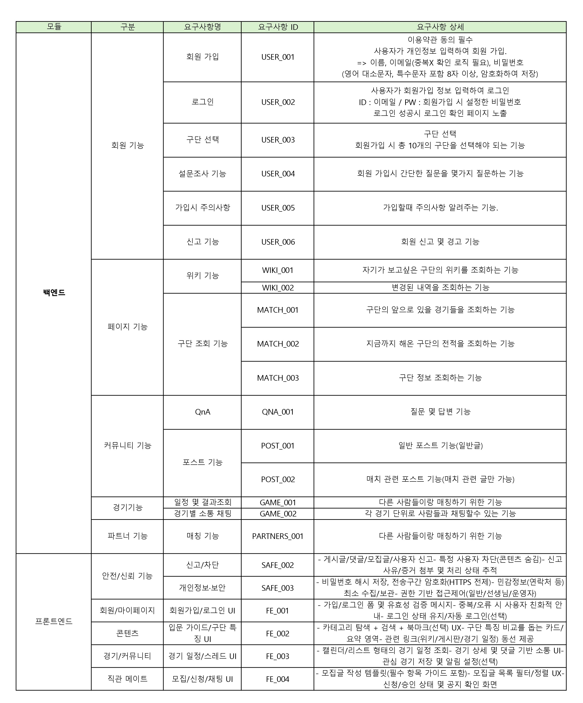
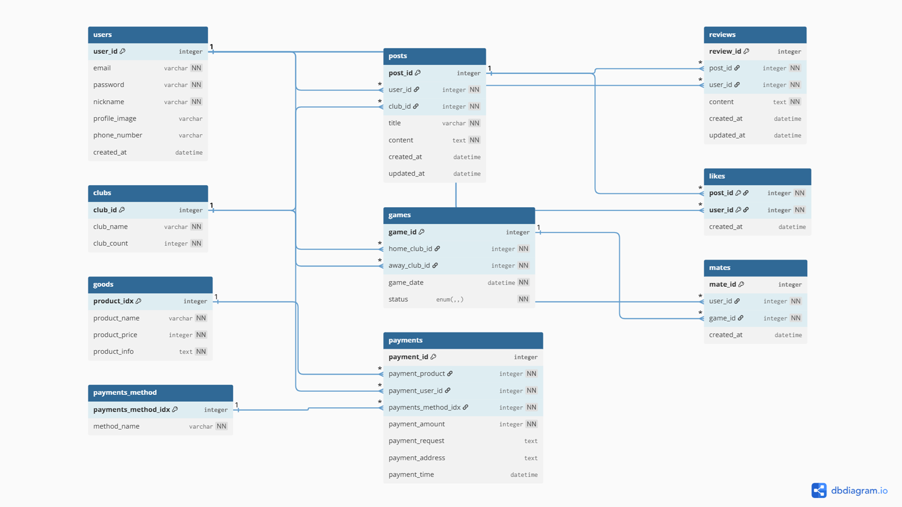

<p align="center">
  
</p>
<!-- =======================================================
Yaple (야플) - README (Fancy)
======================================================= -->

<p align="center">
</p>

<p align="center">
  
</p>


<p align="center">
  <b>야구 입문 · 직관 메이트 · 커뮤니티 · 혜택 · 안전</b><br/>
  <sub>입문자는 더 쉽게, 직관은 더 즐겁게, 커뮤니티는 더 안전하게 🚀</sub>
</p>

<p align="center">
  
  
  
</p>

<!-- ✅ 팀원 -->
<p align="center">
  <b style="font-size:18px;">👥 Team</b><br/>
  <span style="font-size:20px; font-weight:700;">
    김민규 · 범윤준 · 이선엽 · 최재원
  </span>
</p>

<p align="center">
  <a href="#-한-줄-소개">한 줄 소개</a> •
  <a href="#-핵심-기능">핵심 기능</a> •
  <a href="#-사용자-시나리오">시나리오</a> •
  <a href="#-기술-스택">기술 스택</a> •
  <a href="#-문서docs">문서</a>
</p>

---
## ✨ 한 줄 소개
**야플(Yaple)**은 야구 입문자가 팀/룰/관전 포인트를 빠르게 배우고 📚  
경기 직관 동행자를 안전하게 구하며 🤝  
같은 취향의 팬들과 소통할 수 있는 🗣️ **통합 웹 플랫폼**입니다.

<p align="center">
  
</p>

---

## 🎯 Problem → Solution
### 😵 Problem
- 정보가 검색/커뮤니티/SNS로 **파편화** → 입문자가 체계적으로 배우기 어려움
- 동행은 하고 싶지만 **안전/매너 리스크** 존재
- 일정/결과, 굿즈/주변 혜택 정보가 **한 곳에 모여 있지 않음**

### 😎 Solution
- **팀별 위키 + 입문 가이드**로 학습 진입장벽 ↓
- **경기 일정/결과 + 경기데이 커뮤니티**로 “지금 필요한 정보” 제공
- **동행 모집/참여 + 신고/제재**로 안전장치 강화
- **야구장 굿즈상품**으로 관심도도 ↑

---
</p>

## 🧩 핵심 기능
아래 기능들이 한 흐름으로 연결돼요 👇

| 📚 학습(정보) | 🤝 연결(동행) | 🗣️ 소통(커뮤니티) | 🎁 혜택(제휴) |
|---|---|---|---|
| 팀/룰/용어/관전 포인트 | 날짜/구장/팀 기반 모집·참여 | 경기 전/중/후 소통 | 야구 굿즈 |
| 선생님(인증) 편집 | 매칭/확정 흐름 | 질문(Q&A) |

---
</p>

## 👤 사용자 시나리오
### 🌱 새싹(입문자)
회원가입 → 응원 팀 선택 → 입문 가이드 탐색 → Q&A 질문 →  
경기 일정 확인 → 동행 참여/모집

### 🧑‍🏫 선생님(인증 사용자)
팀 위키 작성/수정(출처 기반) → 새싹 질문 답변

### 🧢 직관러(동행)
경기 조건으로 모집글 작성 → 참가자 확인 → 확정 → 후기/평가(확장)

### 🛠️ 관리자
신고 처리 → 경고/제재 → 선생님 인증/권한 관리

---
</p>

## 🛡️ 안전 · 운영 정책

- 오프라인 동행 안전 가이드: 연락처 최소 공개 / 공공장소 만남 권장 ✅

---
</p>

## 🧰 기술 스택
<div>
  
  
  
  
  
</div>

<div>
  
  
  
  
</div>

---
</p>

## 📌 문서(Docs)

### 📄 프로젝트 기획서
<p align="center">
  <a href="docs/프로젝트%20기획안.pdf">
    
  </a>
</p>

<p align="center">
  <a href="docs/요구사항%20정의서.pdf">
    
  </a>
  &nbsp;&nbsp;
  <a href="docs/테이블%20명세서.pdf">
    
  </a>
</p>


### 🧱 시스템 아키텍처
<p align="center">
  
</p>

- ### 🍔 요구사항 명세서 
<details>
  <summary>요구사항 명세서 보기</summary>
     
</details>


### 🗺️ ERD
<p align="center">
  
</p>

---
</p>

## 🚀 실행 방법
```bash
git clone <repo-url>
cd <repo>

cp .env.example .env
docker compose up -d


